# client-server-week02-laravel-setup
Ravien C. Ongkiko - BSIT-3B

<h2>INTRODUCTION<h2>
<h1>Brief Overview of Laravel</h1>

Laravel is a free, open-source PHP web framework that follows the Model-View-Controller (MVC) architecture to simplify and organize web application development. It provides built-in features such as routing, authentication, database management through Eloquent ORM, Blade templating, and security tools, allowing developers to build applications more efficiently. Laravel also includes the Artisan command-line interface for automating common development tasks and supports database migrations for version-controlled schema management. Its clean syntax, extensive documentation, and active community make it one of the most popular frameworks for developing modern, secure, and scalable web applications.

<h1>Importance of Client-Server Technologies</h1>

Client-server technologies are essential in modern computing because they enable efficient communication between users (clients) and centralized systems (servers). This architecture allows multiple users to access shared resources, data, and services over a network while ensuring centralized management, security, and scalability. By separating the user interface from data processing and storage, client-server technologies improve system performance, simplify maintenance, and enhance reliability. They are widely used in web applications, email services, online banking, e-commerce platforms, and cloud-based systems, making them a fundamental component of today's digital infrastructure.


<h1>Purpose of the Project</h1>

The purpose of this project is to provide students with a solid foundation in Laravel development by guiding them through the installation, configuration, verification, and documentation of the essential tools required for a professional Laravel development environment. Through this activity, students gain practical experience in setting up PHP, Composer, Laravel, Git, MySQL, and Visual Studio Code, creating and running their first Laravel application, and applying proper version control practices using Git and GitHub. The project also develops students' ability to produce professional technical documentation, organize development resources, and showcase their work through online platforms such as GitHub and LinkedIn. Ultimately, this activity prepares students for succeeding laboratory exercises and serves as the foundation for the semester-long Enterprise Laravel E-Commerce Project by equipping them with the knowledge, skills, and development environment necessary for building modern client-server web applications.

<h1>Objectives</h1>

1. To install and configure the required software for Laravel development, including PHP, Composer, Laravel, Git, MySQL, and Visual Studio Code.

2. To create and successfully run a Laravel application on a local development server using the `php artisan serve` command.

3. To customize the Laravel homepage by displaying the student's name, student number, course, section, subject, and the current date.

4. To apply Git version control by creating a local repository and publishing the Laravel project to a public GitHub repository.

5. To develop professional technical documentation by preparing a comprehensive README file with installation steps, project structure, screenshots, challenges encountered, and solutions.


<h1>Development Environment</h1>

```text
Operating System: Windows 11
PHP Version: 8.5.9
Laravel Version: 5.31.1
Composer Version: 2.10.1
Git Version: 2.55.0.windows.3 
MySQL Version: 8.0.46
VS Code Version: 1.132.0
```

<h1>Installation Steps</h1>

Step 1: 

```text
1. Install PHP and install PHP 8.x.
2  Open Command Prompt.
3. Verify the installation by running: php -v
4. Ensure that the installed PHP version is displayed.
5. Capture a screenshot of the successful verification.
```

Screenshot: 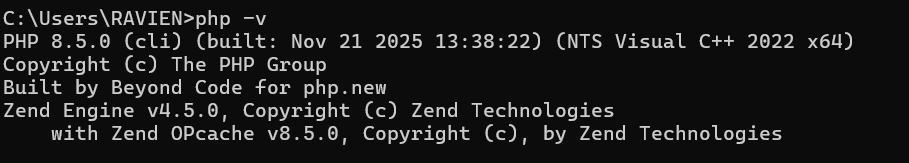

```text
Step 2: 
1. Install Composer from the website.
2. Open Command Prompt.
3. Verify the installation by running: composer -V
4. Confirm that the Composer version is displayed.
5. Capture a screenshot of the successful verification.
```

Screenshot: 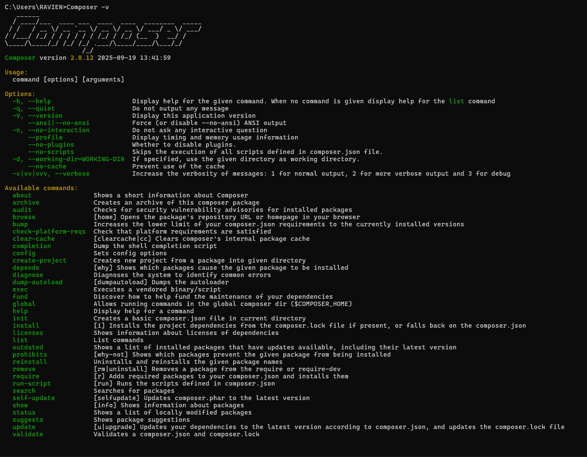

```text
Step 3: 
1. Install Laravel 
2. Install the Laravel Installer using Composer.
3. Verify the installation by running either: laravel -V

or

4. composer global show laravel/installer
5. Confirm that the Laravel version is displayed.
6. Capture a screenshot of the successful verification.

or

7. composer global show laravel/installer
8. Confirm that the Laravel version is displayed.
9. Capture a screenshot of the successful verification.
```

Screenshot: 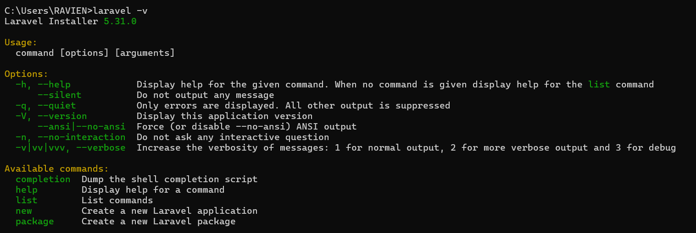

```text
Step 4: 
1. Install Git
2. Download and install Git.
3. Open Command Prompt.
4. Verify the installation by running: git --version
5. Confirm that the installed Git version is displayed.
6. Capture a screenshot of the successful verification.
```

Screenshot: 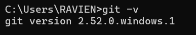

```text
Step 5: 
1. Install MySQL
2. Install MySQL Server.
3. Open Command Prompt.
4. Verify the installation by running: mysql --version
5. Confirm that the installed MySQL version is displayed.
6. Capture a screenshot of the successful verification.
```

Screenshot: 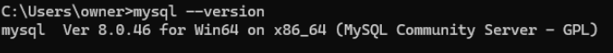

```text
Step 6: 
1. Install Visual Studio Code
2. Download and install Visual Studio Code.
3. Launch Visual Studio Code.
4. Open the Laravel project folder.
5. Capture a screenshot showing the project opened in Visual Studio Code.
```

Screenshot: 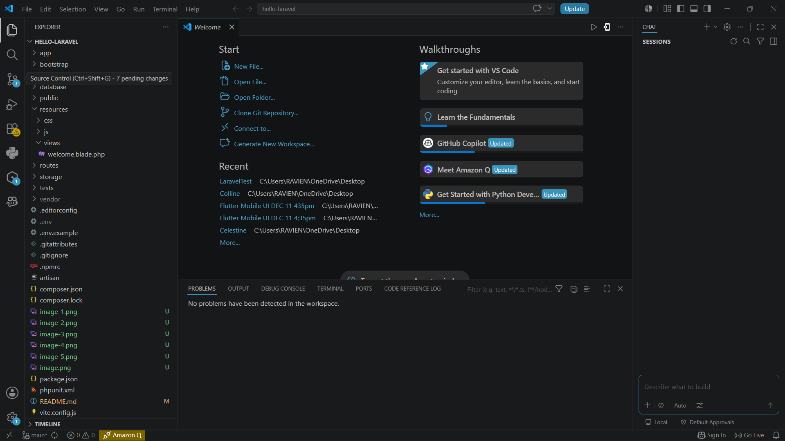

```text
Step 7:
1. Create a Laravel Project
2. Open Command Prompt.
3. Create a new Laravel project using one of the following commands:
4. composer create-project laravel/laravel hello-laravel

or

5. laravel new hello-laravel
6. Wait for the installation process to complete successfully.
```
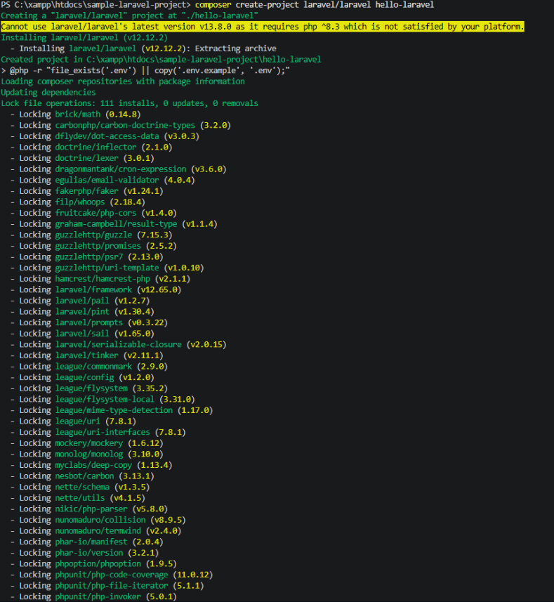
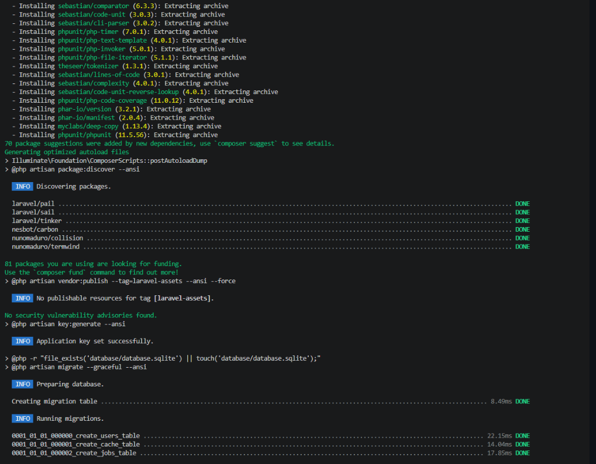

```text
Step 8:
1. Run the Laravel Application
2. Navigate to the project directory. cd hello-laravel
3. Start the Laravel development server. php artisan serve
4. Open your web browser and visit: http://127.0.0.1:8000
5. Verify that the Laravel application loads successfully.
6. Capture a screenshot of the running application.
```
Screenshot:

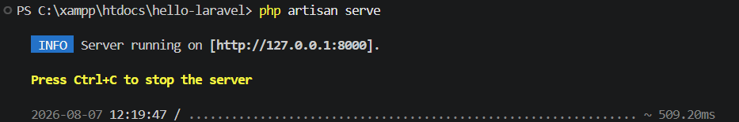

```text
Step 9: 
1. Modify the Homepage
2. Edit the homepage of the Laravel application.
3. Display the following information:
4. Student Name
5. Student Number
6. Course
7. Section
8. Subject
9. Current Date
10. Save the changes.
11. Refresh the browser to verify the updated homepage.
12. Capture a screenshot of the customized homepage.
```

Screenshot: 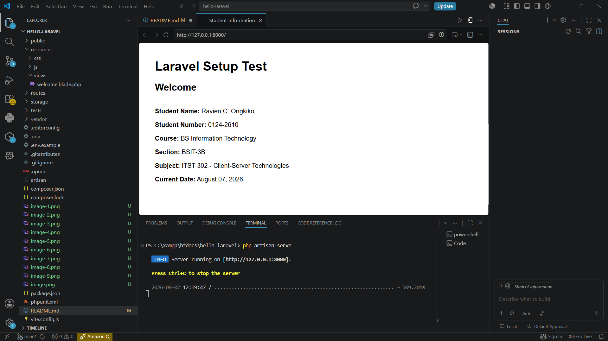

<h1>Project Structure</h1>

app/

The `app/` folder contains the core application code, including controllers, models, and other classes that handle the application's business logic.

routes/

The `routes/` folder stores all route definitions. These routes determine how the application responds to incoming HTTP requests and direct users to the appropriate controllers or views.

resources/

The `resources/` folder contains the application's views, language files, and frontend assets. The `views` subfolder holds Blade templates used to build the user interface.

public/

The `public/` folder is the web server's document root. It contains the `index.php` file, which serves as the application's entry point, along with publicly accessible files such as images, CSS, JavaScript, and other assets.

config/

The `config/` folder stores configuration files for the Laravel application, including settings for the database, mail services, caching, sessions, and other system components.

database/

The `database/` folder contains files related to database management, including migrations, seeders, and factories. These files are used to create, modify, and populate the application's database.

<h1>Problems Encountered</h1>

1. MySQL Command Not Found

Although MySQL was successfully installed, the mysql command was not recognized in the Command Prompt. This prevented the MySQL client from being accessed directly through the terminal, making it difficult to verify the installation and execute MySQL commands.

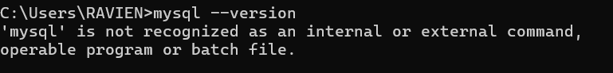

The issue was resolved by locating the MySQL installation folder and adding its bin directory (e.g., C:\Program Files\MySQL\MySQL Server 8.0\bin) to the system's PATH environment variable. After saving the changes, the Command Prompt was closed and reopened to apply the updated environment variables. Running the mysql --version command then successfully displayed the installed MySQL version, confirming that MySQL was correctly configured and accessible from the command line.

2. Difficulty Choosing the Correct PHP Installer

When downloading PHP from the official website, there were multiple versions, architectures, and build types available, making it difficult to determine which installer was compatible with the system and suitable for Laravel development. This caused confusion during the installation process and delayed the setup of the development environment.

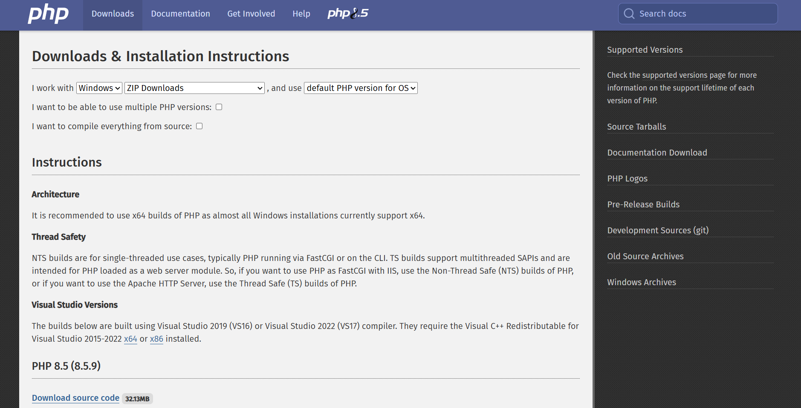

The issue was resolved by reviewing the PHP installation requirements and selecting the appropriate version for the operating system. A 64-bit (x64), Non-Thread Safe (NTS) ZIP package was downloaded since it is the recommended version for most Windows systems and Laravel development. After extracting the files, the PHP directory was added to the system's PATH environment variable. The installation was verified by running the php -v command in the Command Prompt, which successfully displayed the installed PHP version, confirming that PHP was correctly installed and configured.

3. Incorrect Working Directory

While running Laravel commands, an error occurred because the Command Prompt was not opened inside the Laravel project folder. As a result, commands such as php artisan serve could not be executed.


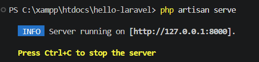

The issue was resolved by navigating to the correct project directory using the cd command before running any Laravel commands. Once inside the Laravel project folder, the commands executed successfully.

<h1>Reflection</h1>

Completing the Week 2 laboratory activity gave me a better understanding of the overall process of preparing a professional Laravel development environment. Throughout the activity, I learned how to install and verify the required software, including PHP, Composer, Laravel, Git, MySQL, and Visual Studio Code. I also learned how these tools work together in client-server web development. Creating the Hello Laravel project allowed me to apply what I learned by creating and running a Laravel application, modifying its homepage, and displaying the required student information. I also gained experience with Git and GitHub by organizing the project, creating meaningful commits, preparing the README documentation, and uploading the necessary screenshots. One of the most challenging parts was troubleshooting installation and configuration problems, such as selecting the correct PHP installer and making commands work properly in the Command Prompt. These challenges taught me the importance of carefully following installation steps and properly configuring the development environment. Overall, this activity improved my technical skills, problem-solving abilities, and understanding of Laravel development. It also gave me a strong foundation for future client-server and Laravel projects, especially the larger projects that will follow throughout the course.

<h1>References</h1>

Laravel. (2026). *Laravel documentation*. https://laravel.com/docs

PHP Documentation Group. (2026). *PHP manual*. https://www.php.net/docs.php

Composer. (2026). *Composer documentation*. https://getcomposer.org/doc/

Git. (2026). *Git documentation*. https://git-scm.com/doc

Microsoft. (2026). *Visual Studio Code documentation*. https://code.visualstudio.com/docs

Oracle. (2026). *MySQL documentation*. https://dev.mysql.com/doc/

<h1>LinkedIn Portfolio Activity</h1>
https://www.linkedin.com/feed/update/urn:li:activity:7491361522884202496/
